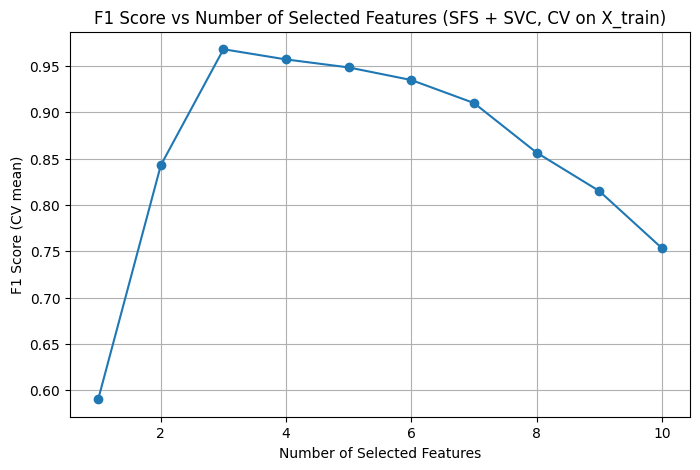
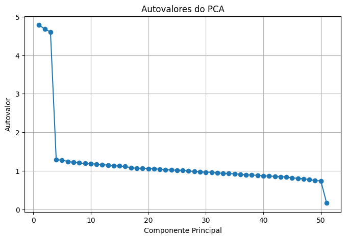
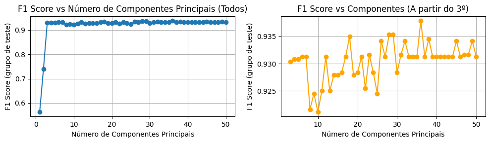
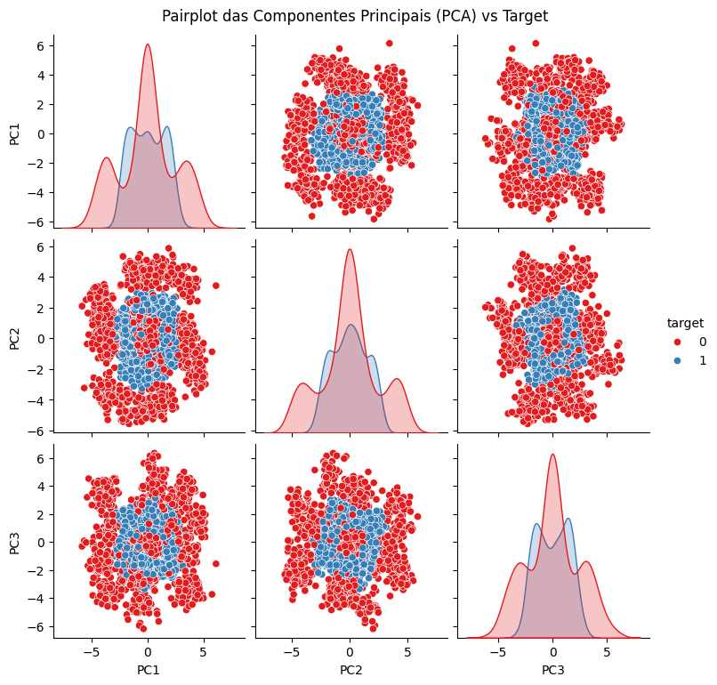
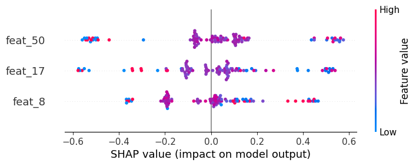

# Projeto Final Aprendizado de Maquinas
Por: Vitor Mello

## Enunciado
### Classificação de Bons e Maus Pagadores

Um cliente do setor financeiro forneceu um conjunto de dados contendo informações de diferentes clientes, com o objetivo de identificar bons e maus pagadores. Cada registro do dataset representa um cliente, descrito por diversas variáveis que indicam características financeiras e comportamentais, além da indicação se o cliente é um bom pagador (classe 0) ou mau pagador (classe 1).

O cliente precisa de uma solução automatizada para classificar novos clientes em bons ou maus pagadores de forma eficaz, para otimizar processos de concessão de crédito e minimizar riscos financeiros.

Por se tratar de decisões que envolvem dinheiro real e impacto direto nas operações da empresa, a solução deve atender aos seguintes requisitos essenciais:

- **Desempenho preditivo confiável:** o modelo deve apresentar bom desempenho para garantir decisões adequadas em dados futuros.
- **Interpretabilidade:** o cliente exige que a solução seja compreensível, de modo que os analistas possam identificar quais características influenciam as decisões e justificar os resultados internamente e para órgãos reguladores.
- **Automação:** o processo deve ser automatizado, abrangendo desde o pré-processamento dos dados até a seleção das variáveis mais relevantes e a construção do modelo final.

Sua tarefa é desenvolver uma solução automatizada que atenda a esses objetivos.

A solução entregue deve conter código completo, organizado e documentado, facilitando sua integração ao fluxo operacional do cliente.

## Resultado
### 1. Análise Exploratória dos Dados (EDA)

Removi variáveis com correlação muito baixa ou muito alta com o target. O resultado pode ser visto na tabela abaixo. Mais detalhes estão disponíveis neste [notebook](notebooks/01_eda.ipynb):

|         |        class |
|:--------|-------------:|
| feat_31 |  1           |
| feat_14 |  0.000856701 |
| feat_24 |  0.000400526 |
| feat_23 |  0.000391264 |
| feat_27 | -0.000502959 |

### 2. Benchmark
Como modelo de referência, foi construido um pipeline com um classificador LightGBM (parâmetros padrão) e ajuste de limiar de decisão (Tuned Threshold) para otimizar o F1-score. O modelo atingiu uma performance de 0,9717.

A interpretação por SHAP indicou que apenas três variáveis — feat_8, feat_17 e feat_50 — concentram praticamente toda a importância do modelo.

Em seguida, plotamos todas as features no espaço tridimensional (ℝ³). O gráfico revelou que as classes são facilmente separáveis, o que motivou a experimentação de um SVM (Support Vector Machine).


### 3. Feature Selection
Para validar a relevância das variáveis, aplicamos uma técnica de seleção sequencial de features (Sequential Feature Selector), utilizando validação cruzada com 5 folds (KFold, cv=5). O processo confirmou a mesma conclusão obtida pela análise com SHAP: as variáveis feat_8, feat_17 e feat_50 são as únicas com contribuição significativa para a performance do modelo.



#### PCA
Como todas as variáveis apresentaram baixa correlação com o target também testei fazer PCA. investigamos a hipótese de que a redução de dimensionalidade via PCA não comprometeria a performance — o que se confirmou.

Abaixo, os autovalores resultantes do PCA:


O gráfico a seguir mostra que a performance do modelo se mantém estável com três ou mais componentes principais:



Além disso, observamos que, após o PCA, o target tornou-se bem separável no novo espaço vetorial, o que encaixa na hipotese do uso do SVM como modelo principal:



Não seguimos com o PCA para manter um certo nível de interpretabilidade, prerequisito do projeto

### 4. HP tuning
Utilizamos o Optuna para realizar o tuning dos hiperparâmetros do SVM. Os melhores parâmetros encontrados foram:

```
"C": 9.754981741396318
"kernel": "rbf",
```

### 4. Benchmark com LGBM
Para comparação, treinamos um modelo benchmark utilizando o LightGBM. O tuning também foi feito com Optuna, e os melhores parâmetros foram:

```
"learning_rate": 0.2026423734492729,
"num_leaves": 83,
"max_depth": 9,
"min_child_samples": 21,
"subsample": 0.9419098599507807,
"colsample_bytree": 0.9985816372861133,
"reg_alpha": 2.8281359110848526e-05,
"reg_lambda": 2.243813364676738e-06
```

### 5. Tuning threshold
Como se trata de um problema de crédito com classes desbalanceadas, utilizamos o F1-score como métrica principal. Para isso, foi necessário ajustar o threshold de decisão. A otimização foi feita com o `TunedThresholdClassifierCV`.

### 6. Treino final
O treinamento final do modelo foi realizado com o pipeline salvo no diretório `src/`, e o binário do modelo foi armazenado como `.pkl` no diretório `models/`.

### 7. Desempenho final
| Model    |   F1 Train |   F1 Test |
|:---------|-----------:|----------:|
| LightGBM |     1.0000 |    0.9621 |
| SVM      |     0.9893 |    0.9810 |

Aqui tem o shap de importancia das features


## Setup (linux ou macos)
Este projeto utiliza o UV para gerenciamento eficiente de dependências Python e instalação do projeto. O UV é um instalador e resolutor de pacotes Python rápido, moderno e projetado como alternativa ao pip e pip-tools.

Sistemas operacionais suportados: Linux, macOS

### 1. Instalando o UV (Optional)

Siga a documentação oficial do UV para instruções de instalação:
- [Documentação UV: Instalando o UV](https://docs.astral.sh/uv/getting-started/installation/#installing-uv)

Exemplo (macOS/Linux via Homebrew):
```
brew install uv
```
### 2. Instalação do projeto

Ao contrário de projetos Python tradicionais que costumam usar requirements.txt ou setup.py, este projeto gerencia suas dependências diretamente por meio de um arquivo .toml. Isso significa que não há arquivos requirements.txt, requirements.in ou setup.py.

Para configurar o projeto e instalar suas dependências, acesse o diretório raiz deste repositório e execute o seguinte comando:

```
pip install -e .
```
Explanation:

- `pip install`: comando que instala pacotes Python.

- `-e .` (instalação em modo editável): este comando instala o projeto de forma que qualquer alteração no código fonte seja refletida imediatamente sem precisar reinstalar o pacote, facilitando o desenvolvimento.
